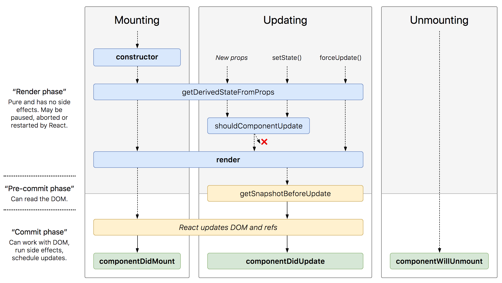

# "누구든지 하는 리액트 "

# 4. LifeCycle API
 컴포넌트가 브라우저에서 나타날때(Mounting), 사라질때(Unmounting), 업데이트될때(Updating)

<p align="center"></p>


## 4.1. 컴포넌트 초기 생성(Mounting)
 **1. constructor**
 - 컴포넌트 생성자 함수
```javascript

constructor(props){
	super(props);
}
```


**2. componentDidMount**
- 컴포넌트가 화면에 나타나게 됐을 때 호출
```javascript
componentDidMount() {
  // 외부 라이브러리 연동(DOM사용): D3, masonry, etc
  // 컴포넌트에서 필요한 데이터 요청: Ajax, GraphQL, etc
  // DOM 에 관련된 작업: 스크롤 설정, 크기 읽어오기 등
}
```


---

## 4.2. 컴포넌트 업데이트(Updating)
**1. getDerivedStateFromProps**
- props로 받아온 값을 state로 동기화 하는 작업을 해야할 경우 사용

```javascript
static getDerivedStateFromProps(nextProps, prevState) {
  // 여기서는 setState 를 하는 것이 아니라
  // 특정 props 가 바뀔 때 설정하고 설정하고 싶은 state 값을 리턴하는 형태로
  // 사용됩니다.
  /*
  if (nextProps.value !== prevState.value) {
    return { value: nextProps.value };
  }
  return null; // null 을 리턴하면 따로 업데이트 할 것은 없다라는 의미
  */
}
```


**2. souldComponentUpdate**
- 컴포넌트를 최적화하는 작업에서 유용하게 사용됨
- 불필요 할 경우  Virtual DOM에 리렌더링하는 것도 방지해줌
- 기본적으로 true반환 / 조건에 따라 false반환하면 해당 조건에는 render함수를 호출하지 않음.

```javascripts
shouldComponentUpdate(nextProps, nextState) {
  // return false;\ 하면 업데이트를 안함
  // return this.props.checked !== nextProps.checked
  return true;
}
```

**3.getSnapshotBeforeUpdate()**
- 이 API를 통해, DOM 변화가 일어나기 직전의 DOM상태를 가져오고, 여기서 리턴값은 componentDidUpdate에서 snapshot 파라미터로 받음.
- 이 API 발생 시점
	1. render()
	**2. getSnapshotBeforeUpdate()**
	3. 실제 DOM 에 변화 발생
	4. componentDidUpdate(prevProps, prevState, snapshot)

```javascriptgetSnapshotBeforeUpdate(prevProps, prevState) {
    // DOM 업데이트 일어나기 직전의 시점
    // 새 데이터가 상단에 추가되어도 스크롤바를 유지
    // scrollHeight : 전,후를 비교해 스크롤 위치 설정 위함
    // scrollTop : 이 기능은 보통 크롬에 이미 구현돼 있음. 이미 구현돼 있다면 처리하지 않도록 하기 위함.

    if (prevState.array !== this.state.array) {
      const {
        scrollTop, scrollHeight
      } = this.list;

      // 여기서 반환 하는 값은 componentDidMount 에서 snapshot 값으로 받아올 수 있습니다.
      return {
        scrollTop, scrollHeight
      };
    }
  }

  componentDidUpdate(prevProps, prevState, snapshot) {
    if (snapshot) {
      const { scrollTop } = this.list;
      if (scrollTop !== snapshot.scrollTop) return; // 기능이 이미 구현되어있다면 처리하지 않습니다.
      const diff = this.list.scrollHeight - snapshot.scrollHeight;
      this.list.scrollTop += diff;
    }
  }

```
**4. componentDidUpdate**
- 컴포넌트에서 render() 호출 후 발생
- 이 시점에선 this.props와 this.state 바뀌어있음.
- prevProps와 prevState조회 가능
- getSnapshotBeforeUpdate 에서 반환한 snapshot 값을 세번째 값으로 받아옴.
```javascript
 componentDidUpdate(prevProps, prevState, snapshot) {

}
```
---
## 4.3. 컴포넌트 제거(Unmounting)
**1. componentWillUnmount**
- 주로 등록했던 이벤트 제거
- 외부 라이브러리 사용했거나 해당 라이브러리에 dispose기능이 있으면 여기서 호출
```javascript
componentWillUnmount() {
  // 이벤트, setTimeout, 외부 라이브러리 인스턴스 제거
}
```
---
##QnA
1.  app.js에 입력 /  MyComponent.js에 입력  차이점?